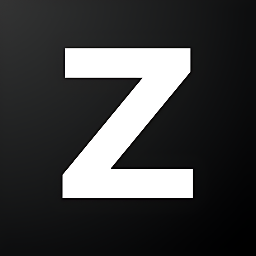

# Ziva

  

  <strong>AI agent for Godot that builds features, fixes bugs, and writes code</strong>

  <a href="https://ziva.sh">Website</a> •
  <a href="https://ziva.sh/download">Download</a> •
  <a href="https://ziva.sh/discord">Discord</a>

---

Ziva is an autonomous AI development assistant built directly into Godot. Instead of pasting into ChatGPT, it intelligently searches your code to find what's important, and handles almost all Godot filetypes.

## What It Does

**Build games faster.** Use natural language to interact with nodes, scripts, and resources. No more manual setup for common patterns.

**Track down bugs.** With in-depth Godot knowledge, explain your bug to Ziva, and let Ziva do the digging to find the rest.

**Built into Godot.** Side panel in the editor. No context switching, no external tools.

## Installation

Download the installer for your platform at [ziva.sh/download](https://ziva.sh/download).

**Supported platforms:**
- Windows (x64, ARM64)
- macOS (Universal)
- Linux (x64, ARM64)

**Requirements:**
- Godot 4.2 or newer

The installer handles everything; downloads the latest version, validates your project, and sets up the plugin automatically. After installation, reopen your project and login.

## Getting Started

1. Open the Ziva panel in Godot (side dock)
2. Sign in with your account
3. Start chatting

Try something like:
- "Fix bullets not colliding with the player"
- "How can I make my enemies spawn with different weapons?"
- "My UI images aren't centered properly, fix it for me"

## Pricing

20 free credits to trial it out. $20 subscription after that.

See [ziva.sh](https://ziva.sh) for current pricing.

## Privacy

Your code is sent to our servers and processed by AI models (currently Gemini). Your code is NEVER used to train models or shared with other third parties.

For more details, see our [privacy policy](https://ziva.sh/privacy).

## Support

- **Bug reports:** [Open an issue](https://github.com/ziva-sh/ziva-agent-plugin-godot/issues)
- **Questions:** [Join our Discord](https://ziva.sh/discord)
- **Email:** hello@ziva.sh

## Development Status

Ziva is in active beta (v0.1.0). Expect bugs and rough edges.

