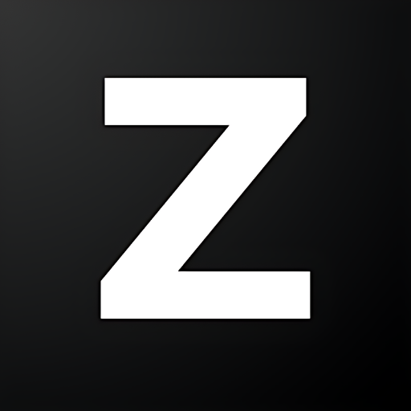

# Ziva

  

  <strong>AI agent inside Godot that builds, debugs, tests, and playtests games</strong>

  <a href="https://ziva.sh">Website</a> •
  <a href="https://ziva.sh/download">Download</a> •
  <a href="https://ziva.sh/docs">Documentation</a> •
  <a href="https://ziva.sh/discord">Discord</a>

---

Ziva is an autonomous AI development assistant for Godot Engine that writes, tests, and fixes code
automatically. Built into the editor, it understands your project beyond the files: scene trees,
scripts, resources, project settings, editor errors, and the running game. Describe an outcome in
natural language and Ziva can implement it, verify it, and let you undo the complete turn in one
click.

## What Ziva Does

- Creates and edits scenes, nodes, signals, resources, scripts, shaders, and TileMapLayer cells
- Writes and refactors GDScript and C# using your project context and current Godot documentation
- Reads editor errors and output, runs tests, captures screenshots, and fixes failures
- Playtests a running game turn by turn with real keyboard and mouse input
- Generates images and imports them into the project
- Adds hosted multiplayer and game analytics with a live dashboard

## Models and Integrations

Choose how the model runs for each task:

- Use Ziva-hosted Claude, GPT, Gemini, DeepSeek, MiniMax, and other models
- Run local models through Ollama or LM Studio
- Connect an existing Claude Code, ChatGPT Codex, or Google Antigravity account
- Give Ziva tools from user-configured MCP servers
- Connect Claude Code, Codex, Cursor, OpenCode, and other MCP clients to Ziva's local Godot tools

Existing-subscription and local-model options are available on the free Hobby plan. Google
Antigravity is an unofficial integration and Ziva displays a risk warning before sign-in.

## Installation

Download the installer for your platform at [ziva.sh/download](https://ziva.sh/download).

**Supported platforms:**

- Windows (x64, ARM64)
- macOS (Universal)
- Linux (x64, ARM64)

**Requirement:** Godot 4.2 or newer.

The installer downloads the latest version, validates your project, and sets up the plugin. Reopen
the project after installation, sign in, and open the Ziva side dock.

## For Studios

Godot is available as a self-serve download. [Ziva for Unity](https://ziva.sh/unity) is in beta
through enterprise engagements; [Unreal Engine](https://ziva.sh/unreal), custom engine work,
private deployments, custom models, and dedicated inference are scoped with each studio.
[Contact Enterprise](https://ziva.sh/enterprise) to discuss a deployment.

Ziva is also [gathering publishing interest](https://ziva.sh/publishing) from developers with a
playable build. Publishing is an exploratory program, not a generally available service.

## Privacy

Your project is never used to train AI models. Ziva labels model data-retention policies, supports
zero-data-retention providers, and can run local models so prompts stay on your computer. All
generated code and assets remain your intellectual property. See the
[privacy policy](https://ziva.sh/privacy) for details.

## Support

- **Documentation:** [ziva.sh/docs](https://ziva.sh/docs)
- **Bug reports:** [Open an issue](https://github.com/ziva-sh/ziva-agent-plugin-godot/issues)
- **Questions:** [Join Discord](https://ziva.sh/discord)
- **Email:** hello@ziva.sh
